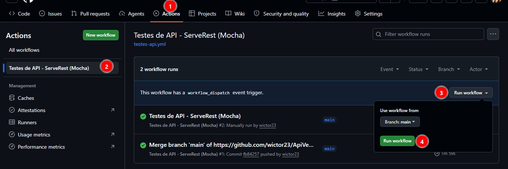

# Testes automatizados da API ServeRest VERITY

Testes escrito no padrão nativo do Cypress: `describe` / `it` do Mocha com asserções Chai, sem camada BDD.

## Stack

| Item | Escolha |
| --- | --- |
| Runner | Cypress 13 (`cy.request`, sem browser) |
| Estrutura de testes | Mocha (describe/it) + Chai |
| Massa de dados | @faker-js/faker (locale pt_BR) |
| Relatório | cypress-mochawesome-reporter |
| CI | GitHub Actions |

## Pré-requisitos

- Node.js 20 (arquivo `.nvmrc` incluso)
- npm 9 ou superior

## Execução manual na Pipeline

## Instalação

```bash
git clone <url-do-repositorio>
cd serverest-api-tests-mocha
npm install
```

## Execução Local
```bash
npx cypress run
npx cypress open
```


## Filtrando por nome do teste, recurso do próprio Mocha:

```bash
npx cypress run --spec cypress/e2e/usuarios_cadastro.cy.js --env grep="e-mail já utilizado"
```
## Estrutura

```
cypress
├── e2e
│   ├── autenticacao.cy.js
│   ├── usuarios_atualizacao.cy.js
│   ├── usuarios_cadastro.cy.js
│   ├── usuarios_consulta.cy.js
│   └── usuarios_exclusao.cy.js
└── support
    ├── commands.js       
    ├── e2e.js            
    ├── limpeza.js        
    ├── factories         geração de usuários com Faker
    └── services          camada de acesso aos endpoints
.github/workflows         pipeline de CI
```
## Relatórios Pipeline
A cada execução da pipeline o relatório é gerado automaticamente.

- **Publicado no GitHub Pages**, com o resultado da última execução da `main`:
  https://wictor23.github.io/ApiVerity/


## Relatórios LOCAL

Depois de `npx cypress run`, os artefatos ficam em `cypress/reports`:

## Observações sobre a API

- O documento do desafio cita as rotas como `/users`. Na instância pública o recurso é `/usuarios`, e é esse caminho que a suíte utiliza.
- A autenticação é feita em `POST /login`, que devolve `authorization` no formato `Bearer <jwt>`. As rotas de produtos entram apenas para comprovar bloqueio e liberação de acesso.
- A API rejeita cadastros com e-mail de gmail e hotmail. A factory gera endereços em `qa.serverest.dev`.
- Limite de 100 requisições por minuto. O `cy.api` aplica intervalo entre chamadas, controlado por `intervaloEntreRequisicoes` no `cypress.config.js` (padrão de 700 ms).
- O `afterEach` global remove os usuários registrados durante o teste, mantendo a base compartilhada previsível. O registro é feito por funções síncronas em `support/limpeza.js`, e não por comando Cypress, para não misturar fila assíncrona com retorno de valor dentro dos callbacks.

## Cobertura

27 testes, mesma paridade da suíte em Gherkin.

### POST /usuarios — 8 testes

Cadastro de administrador com consulta posterior, cadastro sem perfil administrativo, e-mail duplicado e cinco combinações de campos inválidos.

### GET /usuarios e GET /usuarios/{_id} — 4 testes

Listagem com validação de contrato e coerência da `quantidade`, busca por identificador, identificador inexistente e filtro por e-mail.

### PUT /usuarios/{_id} — 6 testes

Alteração com verificação de persistência, upsert em identificador inexistente, e-mail de outro usuário e três combinações de campos inválidos.

### DELETE /usuarios/{_id} — 2 testes

Exclusão com confirmação de que o registro deixou de existir e aviso em identificador inexistente.

### POST /login — 7 testes

Token com credenciais válidas, senha incorreta, três combinações de campos obrigatórios, rota protegida sem token e rota protegida com token válido.
